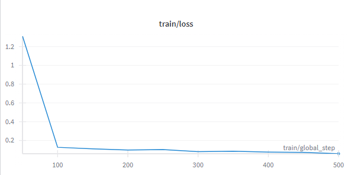
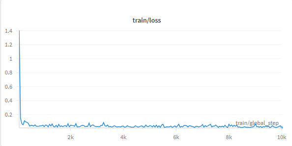
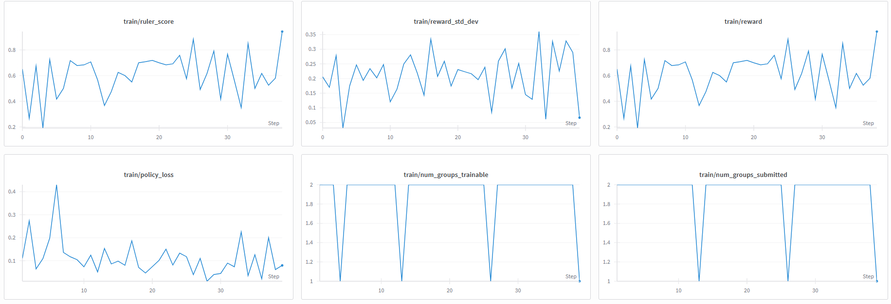
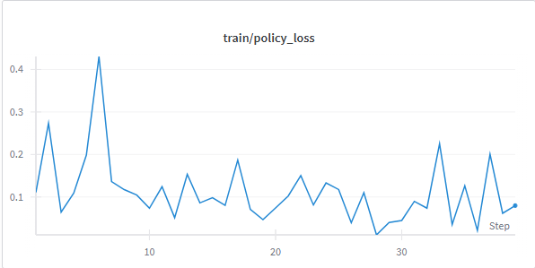

#Phase 1
# Codeuctivity – Smarter Code Summaries via LoRA-fine-tuned CodeT5

[](https://www.python.org/)
[](https://huggingface.co/)
[](https://wandb.ai)
[](LICENSE)
[]()

---

## Overview

**Codeuctivity** is an efficient, transformer-powered summarization tool that helps developers understand their code better by converting functions into natural-language explanations. Behind the scenes, we fine-tune Salesforce’s open-source `CodeT5` model using **LoRA**, enabling lightweight, high-performance adaptation for code-to-docstring generation.

---

## Why It Matters

- **Boost developer productivity**: Auto-generate meaningful summaries to ease onboarding and documentation.  
- **Efficient fine-tuning**: By freezing most of the model and applying LoRA adapters, only ~0.8% of parameters are actually trained — fast and resource-friendly.  
- **Modern foundation**: Built on the powerful CodeT5 model, which sets SOTA benchmarks in code understanding and generation tasks.  

📖 Original CodeT5 Paper: *CodeT5: Identifier-aware Unified Pre-trained Encoder-Decoder Models for Code Understanding and Generation*, Wang et al., EMNLP 2021.  
[Read on arXiv](https://arxiv.org/abs/2109.00859)

---

## Features

- Fine-tuned `Salesforce/codeT5-base` with LoRA adapter (r=16, α=32, dropout=0.1).  
- Trained on the `code_x_glue_ct_code_to_text` (Python subset) dataset for code-to-docstring summarization.  
- Trainer pipeline using HuggingFace `Trainer` API with logging to Weights & Biases.  
- Lightweight inference helper: `.summarize(code)` returns a human-readable summary.  

---

## Architecture & Workflow

1. **Dataset**  
   - HuggingFace dataset: `code_x_glue_ct_code_to_text` (Python).  
   - Splits: Training ~251K, Validation ~13K, Test ~15K.  

2. **Tokenization & Preprocessing**  
   - Prompt format: `"summarize: {code}"`  
   - Max input length: 128  
   - Max output length: 64  

3. **Model & LoRA Configuration**  
   - Base model: `Salesforce/codet5-base`  
   - LoRA adapters train only ~0.787% of parameters.  

4. **Training Setup**  
   - Batch size: 4  
   - Learning rate: 5e-4  
   - Epochs: 1 (pilot run)  
   - Logging/Evaluation: per-epoch with W&B tracking  

5. **Inference**  
   - `.summarize(code)` → docstring output using `model.generate(...)`.  

   **Example:**
   ```python
   def summarize(code):
       inputs = tokenizer(f"summarize: {code}", return_tensors="pt", truncation=True).to(model.device)
       output = model.generate(**inputs, max_length=MAX_OUTPUT)
       return tokenizer.decode(output[0], skip_special_tokens=True)

   print("\n Test prediction:")
   print(summarize("def factorial(n): return 1 if n==0 else n*factorial(n-1)"))
   ```

   **Output:**
   ```
   Test prediction:
   This function calculates the factorial of a number using recursion. If n is 0, it returns 1, otherwise it multiplies n by the factorial of (n-1).
   ```

---

## Training & Evaluation

We conducted two key runs:

1. **Trial Run (500 steps)**  
   - Purpose: Sanity check, pipeline validation.  
   - Results: Quick convergence, indicative of learning capacity.  

   📈 

2. **Full Run (10,000 steps)**  
   - Purpose: Main training, improved generalization.  
   - Results: Lower validation loss, stronger summaries.  

   📉 
- **Final Metrics**  
  - Training Loss: ~0.0137  
  - Validation Loss: ~0.0654  
  

---

## Quick Start

Clone the repo and run:

```bash
git clone <repo-url>
cd codeuctivity
pip install -r requirements.txt  # includes transformers, peft, datasets, wandb, etc.
```

---

## License

This project is licensed under the MIT License. See [LICENSE](LICENSE) for details.

---


# Phase 2: The ReaL work :)

# RL for LLMs – Reinforcement Learning Fine-Tuning with GRPO + RULER

[](https://www.python.org/)  
[](https://pytorch.org/)  
[](https://huggingface.co/)  
[](https://openpipe.ai/blog/ruler)  
[](LICENSE)  

---

## 🚀 Overview

This repository explores **reinforcement learning fine-tuning (RLFT)** for large language models using the **GRPO (Generalized REINFORCE with Policy Optimization)** algorithm.  

Unlike traditional RLHF pipelines that rely on costly labeled datasets, this project uses a **synthetic data pipeline** powered by:  
- **OpenRouter API** → Generates synthetic training/test prompts from LLMs.  
- **RULER (rule-based reward evaluation)** → Scores outputs against task-specific criteria.  
- **GRPO** → Optimizes the model using stable, KL-regularized policy gradients.  

✨ The result is a **closed-loop system** where the model can train itself on **any task** simply by editing the **task description** in the notebook.  

---

## 🔄 How It Works

1. **Task Definition**  
   - Specify your desired behavior in the notebook (e.g., *“Rewrite text in a given style”*).  

2. **Synthetic Data Generation**  
   - Prompts are dynamically generated via **OpenRouter API**.  
   - The model **generates its own training and test samples**.  

3. **RULER Evaluation**  
   - Outputs are evaluated against a **rule-based scoring system**.  
   - Rules can enforce **style, tone, length, coherence, or structure**.  
   - Evaluation can be **deterministic** (programmatic rules) or **LLM-assisted**.  

4. **GRPO Training**  
   - GRPO applies policy gradients with KL regularization for stability.  
   - Rewards from RULER guide the optimization loop.  
---

## ✨ Key Features

- **Synthetic data pipeline** – no datasets required.  
- **Task-agnostic training** – modify the task description to adapt training.  
- **Modular design** – swap prompt-generation and evaluation models as needed.  
- **Stable optimization** – GRPO prevents catastrophic drift.  
- **Style-controlled generation** – output text in different tones while preserving meaning.  

---

## 📚 Background

### 🔹 GRPO in RL Fine-Tuning
GRPO is an RL algorithm that extends REINFORCE with:  
- **KL divergence penalty** to constrain the policy near the base model.  
- **Reward shaping** to capture nuanced preferences.  
- **Variance reduction** via baselines.  

This makes GRPO a **lighter and more stable alternative to PPO** for LLM fine-tuning.  

### 🔹 RULER (Rule-based Rewards)
[RULER (OpenPipe)](https://openpipe.ai/blog/ruler) is a **rule-based evaluation framework** for LLM training.  

- Encodes **programmatic reward functions** (e.g., adherence to style, structure).  
- Allows **fine-grained, interpretable control**.  
- Can use an **LLM as a grader** for more subjective tasks.  

This repo leverages RULER as the **reward function backbone** for RL fine-tuning.  

### 🔹 Related Work
- **ART: RL for LLMs** – modular RLHF training toolkit.  
- **RULER (OpenPipe)** – rule-based evaluation framework.  
- **PPO vs GRPO** – PPO dominates RLHF, but GRPO offers simpler, compute-friendly optimization.  

---

## 📊 Training & Results

This project currently includes **one training run**.  

### Metrics Tracked
- **Reward progression**  
- **Policy loss**  
- **KL divergence**  

📈 Training Graphs:  
  

🪙 Policy Loss:  
  

---

## 🔬 Inference Showcase

After training, the model was tested on **unseen prompts** with style-transfer objectives.  

### Base vs Fine-Tuned Comparison

| **Test** | **Input Prompt** | **Requested Style** | **Base Qwen2.5-1.5B Output** | **Fine-Tuned RL Model Output** |
|----------|------------------|----------------------|-------------------------------|--------------------------------|
| 1 | The server is down, which means nobody can log in to work remotely. | Humorous Gen-Z slang | *The server is down and people cannot log in remotely. It is causing problems and needs to be fixed.* | *The server is down, so we're all stuck at home, unable to log in remotely. This is turning into a major headache for the team. Please fix the situation pronto.* |
| 2 | I regret to inform you that your manuscript does not meet our publication standards. | Shakespearean tragic monologue | *We regret to inform you that the manuscript cannot be accepted at this time. Thank you for your submission.* | *Ah, poor soul, alas, I must inform you that your work does not please our esteemed peers. We, the humble editors, are but a few, yet we do our best to discern the finest sentiments amidst the myriad of submissions. Please accept this as a sign of our respect and admiration for your literary endeavors. It is with a heavy heart that we must part ways, for we do not believe your manuscript to be worthy of our esteemed journal's prestigious publication.* |
| 3 | Hey dude, wanna grab burritos later? Maybe around 7? | Diplomatic correspondence | *Hey, do you want to grab burritos later around 7?* | *Dear [Recipient's Name], Thank you for reaching out. I would be delighted to meet for burritos at approximately 7 PM. Please let me know if you are available at that time, and we can discuss further details. Best regards,  [Your Name]* |
| 4 | The cat knocked over my coffee mug and now there's brown liquid all over my keyboard. | Haiku | *The cat knocked over my coffee and spilled it on the keyboard. It was frustrating.* | *The cat again spills / my coffee, now the keyboard's / covered in brown ink.* |
| 5 | We are writing to confirm receipt of your application for the position of Senior Developer. | Sarcastic breakup text | *We confirm receipt of your application and will review your materials for the Senior Developer position.* | *We confirm receipt of your application... Congratulations, you’ve officially been dumped.* |

---

### 🎉 Capability Summary

The fine-tuned model **`rl-model-001`** can:  
- Dynamically generate its own synthetic data.  
- Rewrite text in requested styles while preserving meaning.  
- Adapt to **any task** with a simple task description change.  

**Example:**  
- Input: *“I had a good day.”*  
  - Sarcastic → *“Oh yeah, because absolutely nothing screams excitement like eating instant noodles alone all day.”*  
  - Poetic → *“The sun caressed my weary soul, and joy bloomed quietly within.”*  

---

## 🛠️ Getting Started

### Requirements
This repo uses:  
- [`weave==0.50.0`](https://pypi.org/project/weave/)  
- [`openpipe-art[backend]==0.4.11`](https://pypi.org/project/openpipe-art/)  
- `torch`, `transformers`, `datasets`, etc.  

### Setup
```bash
git clone https://github.com/Coffeempty/rl_for_llms.git
cd rl_for_llms
